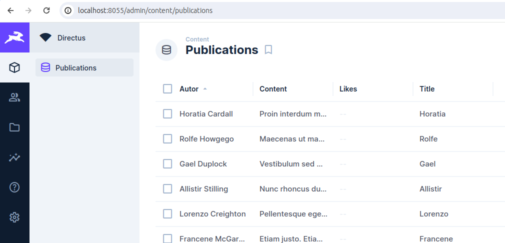

# PAW Test project

## 1. Introduction

This project is based on Quasar Framework + Vue and contains
the `frontend` , `uploads`, `proxy`, `extensions` folders.
   - The `frontend` folder is a Quasar Framework + Vue3, which contains the reactive web interface.
   - The `uploads`& `extensions` folders needs for Directus upload files and extensions
   - The `proxy` folder is Nginx default configuration

We use Dockerized environments for development and production environments.

### 1.1 Directory tree

- **_frontend_** Quasar Framework + VUE3
   - **_public_** - Contains static files and templates
   - **_src_** - Contains all the code to generate the web interface
- **_uploads_** - Directus uploads
- **_extensions_** - Directus extensions
- **_proxy_** - Contains configuration of the reverse proxy used for the <u>development environment</u> 
- **_screenshot_** - Screenshots of images used in README.md
&nbsp;

----

&nbsp;

## 2. Development environment

We use a dockerised environment via docker-compose.

This allows us to work in a very production-like environment.

Advantages:

- No access to the frontend and backend through ports exposed by your own code servers.
- From the beginning we use secure HTTPs and WSS protocols.

Services:

- _proxy_: Nginx server that allows us to use http and access services.
- _frontend_: Quasar Framework for local development. (Accessible through: http://localhost/)
- _database_: Postgres.
- _database_manager_: Direcus. (Accessible through: http://localhost:8055/admin/login)
- _user-authentification_ - FireBase Authentification
- _image-storage_ - FireBase storage


### 2.1. Start complete environment in development mode

- **Option 1** - Showing the logs of all modules:

  ```bash
  $ cd technical-tests
  $ docker-compose up
  ```

- **Option 2** - Detached mode: 
  - Note: Run containers in the background, print new container names.

  ```bash
  $ cd technical-tests
  $ docker-compose up -d
  ```

  - Tips:
    - When you finish your workday, run `docker-compose down`.
    - If you modify the contents of the .env file, to apply your changes, simply run `docker-compose up -d`. 

Now you can access:

- Frontend: https://localhost

    

- API endpoint

    

- Direcus

    

&nbsp;

----

&nbsp;

## Direcus panel

### How get API-KEY


#### 1. Create an collection

Access to `Settings>Data Model` and press `+`.
Write `publications` in the `Name` input, and choose `Generated UUID` for ID. Than add fields into collection.

- **_date_created_** - Date ( auto-insert )
- **_title_** - Publication title ( required, string )
- **_content_** - Publication content ( required, string ) 
- **_autor_** - Autor ( required, string )
- **_image_** - Image name file ( string )
- **_likes_** - List of user's ID ( tags )

#### 2. Create a role

Access to `Settings>Access Control` and press `+`.
In appiered modal set new role `WebApi` (or any name which you like) and press `Save`.

Then allow acces to created previosly `collection`. 


#### 3. Create a user

Access to `User Directory` and press `+`.
Set First Name: `API` and in Last Name: `V1`, scroll down to the `Admin Options` section and in the Token input press `+` for generate a key. Copy that key and press `Save`. 

The key that you have been copied, you should paste as a value for API_Key in `/frontend/.env` file.


Now restart your docker containers:
  ```bash
  $ docker-compose down
  $ docker-compose up -d
  ```
&nbsp;

----

&nbsp;

## FireBase

Configuration for FireBase is located in `./frontend/src/boot/firebase.ts`.


&nbsp;

----

&nbsp;

## 3. FAQs

&nbsp;

### How to clean the database in local development?

  If we modify the validation scheme of mongo, we will have to clean the DB.

  ```bash
  $ docker-compose down
  $ docker volume rm pgdata
  $ docker-compose up -d
  ```

### How can I see the logs of the modules?

  To list the modules that are running, run: `docker ps`
  
  And to see the logs, we will use the name associated to the docker container, for the case of paw-directus we will run: `docker logs -f --tail 100 paw-directus`

&nbsp;

----

&nbsp;

### Decisions 

When my app was runnig on http://172.21.0.5:9000/ and Directus on http://0.0.0.0:8055 i had an CORS blocking. So i decided use Nginx and run all app with one command line. So I create a `paw-frontend` container for run Quasar Framework and `paw-proxy` for Nginx. 

### Problems

- docker-compose.yml configuration for Directus.
  - Resolved by reading Directus Docs.

- Nginx configuration
  - Resolved

- Configuration Directus Panel
  - Not resolved. After stop containers or shotdown my PC Directus lost all configurations, and data. 
   I made an export files before stop docker containers, but `roles` & `users` still missing. It's provide a problem for generate an API_KEY

- FireBase configuration.
   - Resolved by reading Docs.
- Implement FireBase Auth and FireBase Storage into APP.
   - Resolved by wathing an online course for Quasar where shows how use `boot` and `plugins`. 
- Dificults for using `composable`. Sometimes Vue `watch` doesn't work how I was expected.
- There are problems with update data via Directus because it use cache.
  After reload(F5) a page the data looks like not updated but in BBDD it is.  


&nbsp;

----

&nbsp;

### Recursos Adicionales
- **VueJs**: [Documentación oficial de VueJs](https://vuejs.org/)
- **Quasar Framework**: [Documentación de Quasar](https://quasar.dev/)
- **Directus**: [Documentación de Directus](https://docs.directus.io/)
- **Docker Compose**: [Documentación de Docker Compose](https://docs.docker.com/compose/)
- **Firebase Authentication**: [Documentación de Firebase Authentication](https://firebase.google.com/docs/auth)